# GDC DNA-Seq Pipeline

## Implemented with the BioDepot-workflow-builder (Bwb)

# Table of Contents
* [Overview](#overview)
  * [Reference genome](#reference-genome)
  * [Workflow in the demo state](#workflow-in-the-demo-state)
  * [Modifying workflow for alternate samples](#modifying-workflow-for-alternate-samples)
  * [Example: Using samples from GEN3 and GDC](#example-using-samples-from-gen3-and-gdc)
  * [Modifying workflow for alternate reference genome](#modifying-workflow-for-alternate-reference-genome)
  * [Archive and cleanup output files](#archive-and-cleanup-output-files)
* [Appendix](#appendix)
  * [Download widgets](#download-widgets)
    * [gcloud_download](#gcloud_download)
    * [downloadURL](#downloadurl)
    * [gen3_download](#gen3_download)
  * [Common issues with workflows](#common-issues-with-workflows)
  * [Software and hardware specifications](#software-and-hardware-specifications)
* [References](#references)

# Overview
The DNA-Seq Workflow is based off of the Genomic Data Commons documentation located here: [https://docs.gdc.cancer.gov/Data/Bioinformatics_Pipelines/DNA_Seq_Variant_Calling_Pipeline/](https://docs.gdc.cancer.gov/Data/Bioinformatics_Pipelines/DNA_Seq_Variant_Calling_Pipeline/)

## Reference genome
All alignments are performed using the human reference genome GRCh38.d1.vd1. This can be found here: [https://gdc.cancer.gov/about-data/gdc-data-processing/gdc-reference-files](https://gdc.cancer.gov/about-data/gdc-data-processing/gdc-reference-files)

## Workflow in the demo state
The workflow requires one file to be usable in the demo state, a _gdc-token.txt_ which can be obtained from: [https://portal.gdc.cancer.gov/](https://portal.gdc.cancer.gov/)

Once the required token file is obtained, the file should be placed in the Bwb mapped/data directory. Update the _Start _widgets GDC token field under the optional entries tab to match the file location or move/rename files on disk to match the default value.

The Start widget optional entries tab has a field for the gdc-token.txt as well as credentials.json. A GDC credentials or config file is not required but the optional field must be filled in with a non-empty string as this is a required input for the gen3_download widget.  A _credentials.json_ file can be obtained from: [https://gen3.datacommons.io/](https://gen3.datacommons.io/login) or [https://nci-crdc.datacommons.io/](https://nci-crdc.datacommons.io/login) if required for a specific workflow.

Begin the workflow by clicking the Start button from the Start widget.

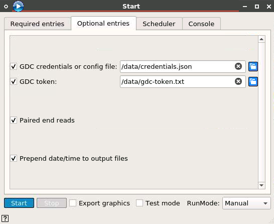

## Modifying workflow for alternate samples
A normal and tumor sample are expected to be named 'normal.bam' and 'tumor.bam' by default. The samples should be downloaded to the Bwb mapped /data/work directory. To change the default location or name of the normal and tumor bam files, the Start widgets required entries should be updated to reflect this change.

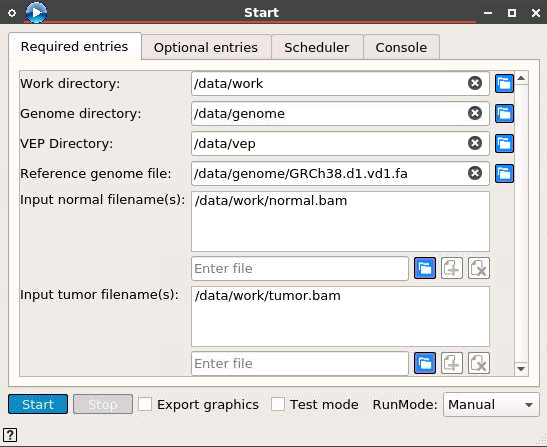

The normal and tumor sample files are downloaded via the gcloud_download widget in the demo state. Swap out the widget named 'Download sample' with the preferred download widget (see _download widgets_ appendix section).

Connect the Start widgets work directory output to the input download directory of the widget, also connect any output of the download widget to the input trigger of the biobambam2 widget. Configure Run mode of the supplied download widget for 'Triggered', and select 'downloadDir' from the dropdown as pictured below.

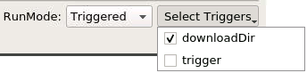

## Example: Using samples from GEN3 and GDC
Samples from the GEN3 data commons and GDC data portal can be accessed and used in this workflow. Whole exome sequencing (WXS) .bam file samples for solid tissue normal and primary tumor samples have been tested for this workflow. For more information about the GEN3 widget, visit the [GEN3 readme](../GEN3readme.md).

First, remove the "Download Sample" _gcloud _download_ widget, then replace it with the _gen3_download_ widget.

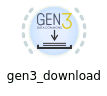

Connect the start widget to the GEN3 widget. connect work_dir output from the start widget to downloadDir from GEN3's widget, and also connect gdc_token output from the start widget to gdctoken from GEN3's widget.

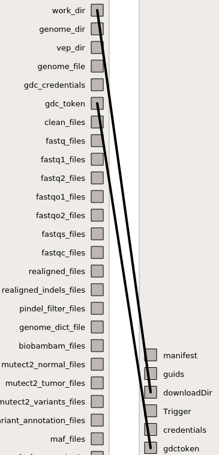

If the selection for work_dir and gdc_token do not appear on the screen, right-click on the 'Edit Links' section on the bottom of the page and select 'Maximize'.

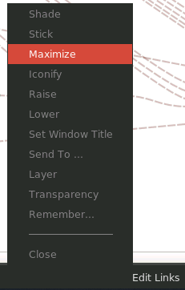

Connect the GEN3 widget to the _biobambam2 _widget, connecting downloadDir to trigger.

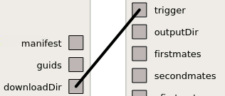

In the GEN3 widget, enter the GUIDs/UUIDs of the normal and tumor samples.

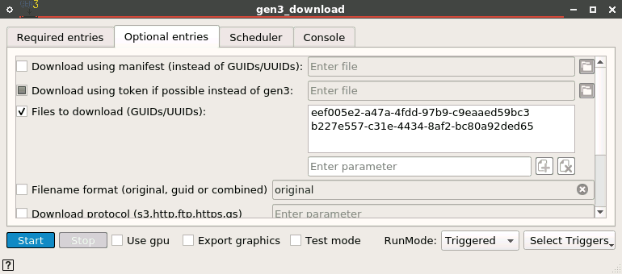

Set the RunMode on the GEN3 widget to Triggered, and set the Triggers for downloadDir and gdctoken (or credentials if using gen3 data commons).

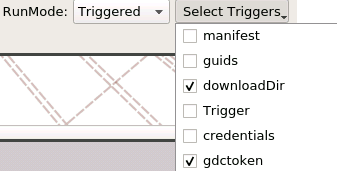

Enter the '.bam' input file names into the start widget for the normal and tumor samples preceded by the Work directory.

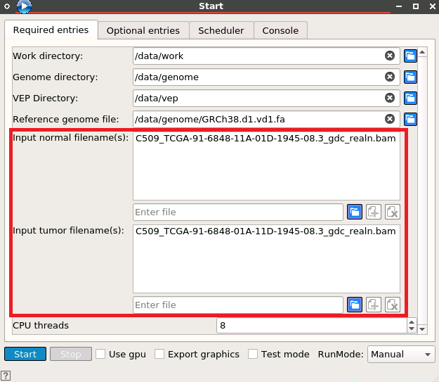

## Modifying workflow for alternate reference genome
The default GRCh38 reference genome is downloaded via the widget named 'Download GDC files'. If the reference file(s) are updated, populate the changes via the Start widget Reference genome file field.

## Archive and cleanup output files
All outputs of the DNA-seq workflow can be archived into a tar file and then deleted from the workspace. This is an optional step in the workflow that requires the Archive and Cleanup widget be opened and then selected using the Start button.  By default the widget will archive using bzip2 compression and include the normal and tumor samples.

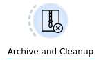

# Appendix

## Download widgets
There are a number of widgets for downloading files within Bwb:

### gcloud_download
Google Cloud is accessible via the _gcloud_download_ widget.

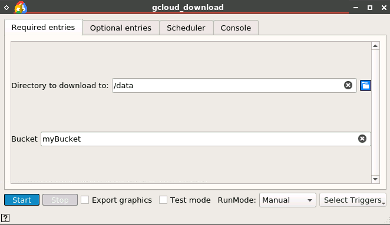

### downloadURL
Google Drive and any URL not requiring credentials is accessible via the _downloadURL_ widget.

### gen3_download
GEN3 data commons and the GDC data portal are accessible via the _gen3_download_ widget.

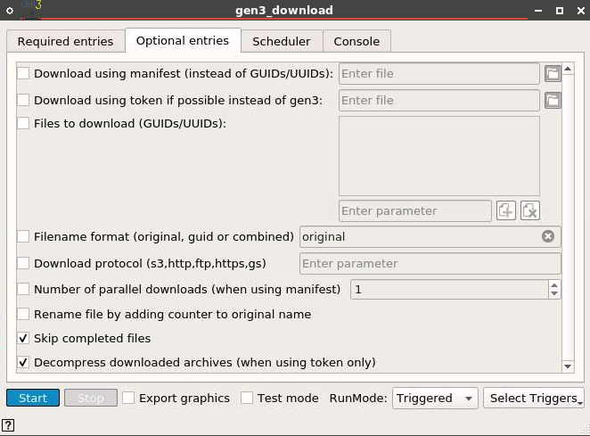

## Common issues with workflows
One of the biggest issues with the GDC workflow is that several tools have changed throughout the course of their life cycles. Often major revisions of tools will come with option changes. Certain options may be deprecated or deleted entirely. Sometimes option flags will be renamed or inputs will need to be passed in a different way. All of these things sound very minor but turn what could be a straightforward workflow into a several hour debugging session. The point is to use care when updating tool versions or widgets.

## Software and hardware specifications
The GATK Germline workflow was tested on an AWS Elastic Cloud Compute (EC2)  instance with the following specifications:

| Option | Value|
| - | - |
| Instance Type | r5d.2xlarge
| Distribution | Ubuntu server 20.04
| Disk space | 50GB
| Memory | 64GB
| vCPU | 8

The workflow was tested with version 1.0 of Bwb ([https://github.com/BioDepot/BioDepot-workflow-builder/releases/tag/v1.0,0](https://github.com/BioDepot/BioDepot-workflow-builder/releases/tag/v1.0,0))

# References
Dna-seq analysis pipeline. (n.d.). Retrieved March 07, 2021, from [https://docs.gdc.cancer.gov/Data/Bioinformatics_Pipelines/DNA_Seq_Variant_Calling_Pipeline/](https://docs.gdc.cancer.gov/Data/Bioinformatics_Pipelines/DNA_Seq_Variant_Calling_Pipeline/)
