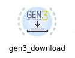
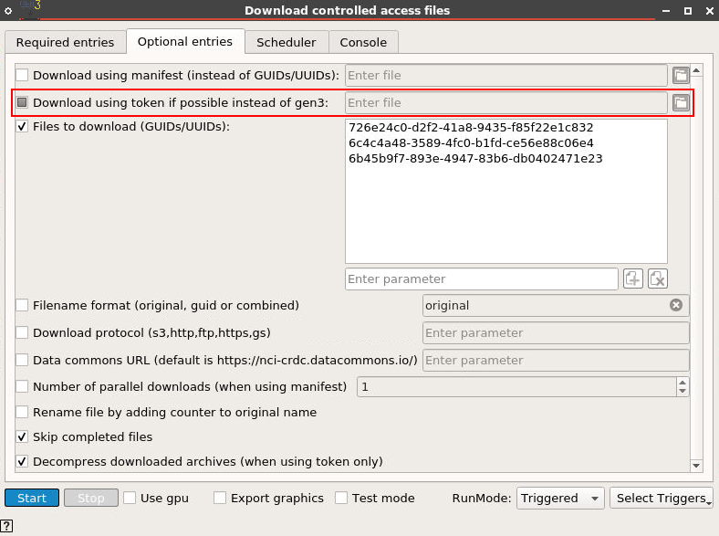
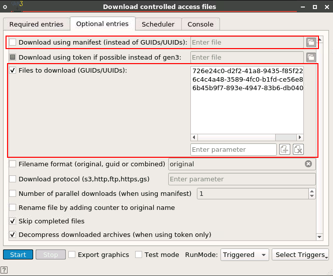

# GEN3 Download Widget

# Implemented with the BioDepot-workflow-builder (Bwb)

# Table of Contents
* [GEN3 Download Widget](#gen3-download-widget)
* [Implemented with the BioDepot-workflow-builder (Bwb)](#implemented-with-the-biodepot-workflow-builder-bwb)
* [Overview](#overview)
  * [Required fields for GEN3 Client Download](#required-fields-for-gen3-client-download)
  * [Downloading a GEN3 credentials file](#downloading-a-gen3-credentials-file)
  * [Downloading a GDC token file](#downloading-a-gdc-token-file)
  * [Optional fields for GDC API download](#optional-fields-for-gdc-api-download)
  * [Providing a manifest or GUID/UUIDs](#providing-a-manifest-or-guiduuids)
  * [Obtaining manifest file](#obtaining-manifest-file)
* [References](#references)
  * [GEN3 client documentation](#gen3-client-documentation)
  * [GDC API documentation](#gdc-api-documentation)

# Overview

The GEN3 download widget in the DNA-Seq Pipeline workflow contains functionality to both download files from the GEN3 Open Access Data Commons [https://gen3.datacommons.io](https://gen3.datacommons.io) and [https://nci-crdc.datacommons.io/](https://nci-crdc.datacommons.io/). In addition, the widget will download files from the GDC API if provided an optional gdc-token (see the following for GDC API details, [https://docs.gdc.cancer.gov/API/Users_Guide/Getting_Started/](https://docs.gdc.cancer.gov/API/Users_Guide/Getting_Started/))

## Required fields for GEN3 Client Download

A _download directory_ must be specified with the location to store all downloaded content.  Because the core functionality of the widget is based on the GEN3 client, both a _config or credentials file_ and _profile name_ (i.e. the same username used to download credentials) must be entered into the appropriate fields prior to starting the widget.

## Downloading a GEN3 credentials file

GEN3 credentials can be downloaded from [https://gen3.datacommons.io](https://gen3.datacommons.io) and/or [https://nci-crdc.datacommons.io/](https://nci-crdc.datacommons.io/).

1. Login to the data commons portal.
2. Click on the profile button at the top navigation bar.
3. Click the “Create API key” button, and download the JSON token.
4. Copy the JSON credentials file to the directory mapped to the /data directory in Bwb.

## Downloading a GDC token file

GDC token can be downloaded from [https://portal.gdc.cancer.gov/](https://portal.gdc.cancer.gov/).

1. Login to the web portal using the “Login” button.
2. Click on the profile button at the top navigation bar.
3. Click on the “Download Token” link.
4. Copy the token file to the directory mapped to the /data directory in Bwb.

Note that PIs need to apply for access to controlled data prior to downloading GDC tokens. Please refer to [https://gdc.cancer.gov/access-data/obtaining-access-controlled-data](https://gdc.cancer.gov/access-data/obtaining-access-controlled-data) for detailed instructions.

## Optional fields for GDC API download

If the GDC API is to be used instead of (or in addition to) the GEN3 client, the _Download using token_ checkbox must be enabled in the optional entries menu and the location of a gdc token file must be specified (placeholder info may be entered into the required credentials file and profile field if the GEN3 client will not be used).

## Providing a manifest or GUID/UUIDs

Currently the widget only supports using a _Download manifest_ file (containing information including GUID/UUID) or a list of _GUID/UUIDs_ but one or the other must be specified (not both).

## Obtaining manifest file

Manifest files contain information including GUID/UUIDs, filenames, checksum, and file size. As of writing this there are two different file formats .txt and .json. GDC Data Portal ([https://portal.gdc.cancer.gov/](https://portal.gdc.cancer.gov/)) provides manifest downloads as .txt files; these file types currently function for GDC downloads only. The GEN3 data commons ([https://nci-crdc.datacommons.io/](https://nci-crdc.datacommons.io/) and [https://gen3.datacommons.io](https://gen3.datacommons.io)) provide manifest files in the .json format.

# References

## GEN3 client documentation

Additional documentation regarding the the GEN3 client can be found here, [https://gen3.org/resources/user/gen3-client/](https://gen3.org/resources/user/gen3-client/)

## GDC API documentation

GDC documentation can be found here, [https://docs.gdc.cancer.gov/API/Users_Guide/Getting_Started/](https://docs.gdc.cancer.gov/API/Users_Guide/Getting_Started/)
