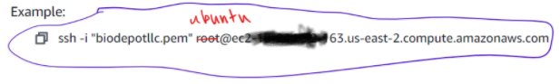

**<span style="text-decoration:underline;">PURPOSE</span>**

To set up AWS for intentions of using EC2 with BWB workflows
EC2 instances are virtual machines you can run BWB on, and there are multiple types of instances with various available hardware specifications to choose from.

**NOTES**: 

* This tutorial is intended for Windows 10, but most of these steps should still apply for MacOS or Linux-based OS machines. 
* If you are a Windows 10 user, this tutorial will require a Unix-based shell to check portions of the setup. It is recommended to have Ubuntu installed ([A good tutorial provided here](https://www.youtube.com/watch?v=X-DHaQLrBi8)) or Bash (untested, but may wield similar results).

A video recording covering most of this material (UW Zoom required):

[https://washington.zoom.us/rec/play/bf79FXqP58Dq26LHXyeMxCAamOkqzozHIRxru0wfa7eA_6oycSlMajczF0rxAUmiYlPYGDay8BI2ft1F.hnB6vv9XNZmh6WKg](https://washington.zoom.us/rec/play/bf79FXqP58Dq26LHXyeMxCAamOkqzozHIRxru0wfa7eA_6oycSlMajczF0rxAUmiYlPYGDay8BI2ft1F.hnB6vv9XNZmh6WKg)

# Table of Contents
* [1. **Creating an AWS account**](#1-creating-an-aws-account)
* [2. **Setting up and launching an EC2 instance**](#2-setting-up-and-launching-an-ec2-instance)
  * [**<span style="text-decoration:underline;">2.1: Create a Key Pair</span>**](#span-styletext-decorationunderline21-create-a-key-pairspan)
  * [**<span style="text-decoration:underline;">2.2: Change permissions on the Key Pair</span>**](#span-styletext-decorationunderline22-change-permissions-on-the-key-pairspan)
  * [**<span style="text-decoration:underline;">2.3: Create the EC2 Instance</span>**](#span-styletext-decorationunderline23-create-the-ec2-instancespan)
* [3. **Connecting to the EC2 instance**](#3-connecting-to-the-ec2-instance)
  * [**Option 1: Connecting through Terminal (ie: Ubuntu)**](#option-1-connecting-through-terminal-ie-ubuntu)
  * [**Option 2: Connecting through PuTTY**](#option-2-connecting-through-putty)
  * [**Option 3: Connecting through MobaXterm**](#option-3-connecting-through-mobaxterm)
* [4. **EC2 instance maintenance**](#4-ec2-instance-maintenance)
  * [**<span style="text-decoration:underline;">4.1: Setting up Ephemeral Storage</span>**](#span-styletext-decorationunderline41-setting-up-ephemeral-storagespan)
  * [**<span style="text-decoration:underline;">4.2: Another awscli configuration for this instance</span>**](#span-styletext-decorationunderline42-another-awscli-configuration-for-this-instancespan)
  * [**<span style="text-decoration:underline;">4.3: Saving the work from <code>/mnt/data/</code> to S3 buckets</span></strong>**](#span-styletext-decorationunderline43-saving-the-work-from-codemntdatacode-to-s3-bucketsspanstrong)
  * [**<span style="text-decoration:underline;">4.4: Running BWB</span>**](#span-styletext-decorationunderline44-running-bwbspan)
  * [**<span style="text-decoration:underline;">4.5: Exiting the instance</span>**](#span-styletext-decorationunderline45-exiting-the-instancespan)
* [5. **Stopping an EC2 instance**](#5-stopping-an-ec2-instance)

# 1. **Creating an AWS account**

If you are an intern or assisting as an employee of Biodepot LLC, it is best to contact one of the officers, most likely Dr. Ling-Hong Hung, for an AWS account for BWB.

Once you are given an account, set a new password for the account. If you want to log into this account again, select the sign in as an “IAM user” and set the Account ID to “biodepot”.


# 2. **Setting up and launching an EC2 instance**

## **<span style="text-decoration:underline;">2.1: Create a Key Pair</span>**

A key pair is a way for AWS to identify you when you want to connect to an EC2 instance. You will have to create a key pair for yourself to use when you want to connect to an instance. These key pairs will be in the form of a `.pem` file in most cases. The alternative is a `.ppk` file, which is mostly used with the terminal emulator application PuTTY (see [Section 3](#3-connecting-to-the-ec2-instance) for more details). **We recommend creating this key pair as a <code>.pem </code>file for now</strong>**, as you can always convert it to <code>.ppk</code> using PuTTY later.

On the AWS Management Console page, click on “All services” and click on “EC2” under “Compute”. This will be the main page for EC2.


Next, on the left side, scroll down to “Network and Security” and select “Key Pairs”.


Click on the top-right corner “Create key pair”. You will see the options to create a key pair.


* Name the key pair for yourself.
* Select “pem” as file format
* Tags are optional. If running multiple instances requiring different key pairs, then it’s best to add tags. But if you are new, do not include tags for now.

Once you create the key pair, you should see the key pair `.pem` file has been downloaded to your computer. **DO NOT CHANGE OR DELETE THIS FILE.**

## **<span style="text-decoration:underline;">2.2: Change permissions on the Key Pair</span>**

The downloaded key pair is not yet usable at its current state. Permissions on the key pair file needs to be less permissive.

On your Unix shell, go to where your `.pem` file is stored (likely in your Downloads folder). Run the command  **<code>ls -l *.pem</code></strong>**, and you should see your <code>.pem</code> file listed. If you see this listed to the left of your <code>.pem</code> file:


Then your key pair is too permissive. To fix this, enter the following command:

```
chmod 600 'sample.pem'
```

* Replace ‘<code>sample.pem</code>’ with your own key pair name. Keep the ‘single quotes’.

Check the `.pem` file again, and you should see it listed to this:


That means your key pair is correctly modified.

## **<span style="text-decoration:underline;">2.3: Create the EC2 Instance</span>**

You are now ready to launch an EC2 Instance. Scroll to the Instances tab on the left and click on “Launch instance” button on the top-right corner.


BWB-affiliated AWS accounts have AMIs set up already for you. AMIs are like presets for you when you want to create an instance, with pre-existing files and scripts to use to make running BWB easier. Think of AMIs as a class, and your EC2 as an instance (“object”) instantiated from the AMI. \

You will have to go through the process step-by-step to set up the instance. **DO NOT CLICK “REVIEW AND LAUNCH” BLUE BUTTON**. **Just click “Next”**.

BWB has multiple AMIs to choose from, but the default AMI you should pick is the “**base**” AMI. In **Step 1**, click on “My AMIs” and choose the “**bwb-base-ami**” AMI.


In **Step 2**, you will have to choose an Instance Types. There are hundreds of types to choose from. The general recommended instant type to choose from is the **c5** instances, specifically the **c5d.2xlarge or c5d.4xlarge**.

* “c” for the family type
* “5” for the generation
* “d” to specify it uses SSD memory
    * You will see “n” for fast network performance

If running a workflow prioritizes RAM usage. Utilize the **r5d** instances, a **r5d.xlarge** or **r5d.2xlarge** should provide enough memory

<table>
  <tr>
   <td>
   </td>
   <td>c5d.2xlarge
   </td>
   <td>r5d.2xlarge
   </td>
  </tr>
  <tr>
   <td>CPU Cores
   </td>
   <td>8
   </td>
   <td>8
   </td>
  </tr>
  <tr>
   <td>RAM
   </td>
   <td>16 GB 
   </td>
   <td>64 GB
   </td>
  </tr>
</table>

In **Step 3**, you will configure the instance. There are many options to pick, And most options you do not need to change. The parts you will need to change are highlighted below:


* **Request a spot instance**
    * This is a cost-saving method to use up excess capacity portions in the cloud, that is cheaper than reserving capacity just for you.
    * Because of that, you should save the memory you want to retain in your instance to the EBS ROOT volume (see [Section 4](#4-ec2-instance-maintenance) for more details).
* **Persistent request** and set Interruption behavior to “**Stop**”
    * This allows you to *__stop__* the instance when you do not want to run the instance. That way you do not have to *terminate* the instance and recreate the instance every time you want to use it.
    * **Make sure that when you want to terminate the instance, YOU MUST DELETE/TERMINATE THE SPOT REQUEST TOO!** The spot request will remain and will eat up money if kept there (see [Section 5](#5-stopping-an-ec2-instance) for more details).

In **Step 4**, you will add storage if necessary. 


* The BWB base AMI has a default of 8GB storage for the **ROOT volume**. This storage will be kept when stopping the instance.
    * Change the size to at least 20GB to run the Bwb
    * Delete the volume when the instance is terminated.
    * Be careful if you want to make the size larger. It is “easy” to expand the size, but it is not possible to decrease the size.
* The **ephemeral** storage, when selecting “d” instance types, will hold much more data than ROOT, but this storage will be lost and unoptimized when stopping the instance.

In **Step 5**, you will add tags for this instance. The tag will indicate this specific instance out of all the other instances the BWB group are running. 

**Key** is the category of the tag, and **Value** is the specific identifier of this instance. The main page for the instances has the “Name” category listed, with each instance having their own value.


For this instance, you will have to put down the Key as “Name”, and Value as whatever you want to call your instance.


In **Step 6**, you will configure the security.


* “**Source**” restricts who can access this instance based on the **IP address** of the user. **0.0.0.0/0 allows anyone to access it**. You can restrict it to your current IP address, but you will not be able to access it when you go outside your current location. THIS IS BAD IF YOUR IP SET BY YOUR ISP IS “DYNAMIC”.
    * If you are “nomadic” and want to use this EC2 instance elsewhere, you should keep the Source set to “Anywhere”.
* **Add another Rule** set to “**Custom TCP Rule**”, and set the Port Range to **6080**. This allows access to BWB in your browser when using the EC2 instance.

In **Step 7**, you will review the configuration of this EC2 instance. Once you are ready to launch, click on the “**Launch**” button.

Before it officially launches, you must associate the instance with the **key pair** created in [Section 1](#1-creating-an-aws-account).


* This means every time you want to use the instance, you will have to provide the key pair `.pem` file you created. 

Once you launch the instance, the instance will be created if the spot request is available to use. There might be times where the launch fails, so you will have to retry the launch at another time.

Your launched instance will appear in the instances page:


# 3. **Connecting to the EC2 instance**

Having a running instance means it is up and running and ready to connect. If it is your first time launching, it may take a couple of minutes to fully set up. To connect to a running instance, there are a couple of different ways of doing so. For Windows 10, there are different options to choose from, but the first option applies to any unix-based console usages (MacOS and Linux included).

For all of these options, you will first need to access the “Connect to instance” page. You will select the instance you want to connect, and go to the top-right corner to click “Actions” then “Connect”.

This is the page you should be on:


* The “Example” is the text you should focus on.
* What is shown as “root”, or “ec2-user” in some AWS tutorials online, should be “**ubuntu**” for BWB.

## **Option 1: Connecting through Terminal (ie: Ubuntu)**

Using AWS from terminal requires you to have **awscli** installed on your terminal and put in your **Access keys** for your account. If your account does not have an **IAM** user credential set up initially, you will need to set one up yourself.

Go to the top-right corner and click on “My Security Credentials”


You will know if you do not have any access keys if the section of Access kesy looks like this:


You will create an access key by clicking on the button.

* YOU SHOULD DOWNLOAD THE .CSV FILE THAT HOLDS YOUR ID AND SECRET KEY. You cannot access them again once you close this page.
* Keep this page up for now, you will need to copy these keys to the terminal.

On the terminal, install awscli using this command:

```
sudo apt install awscli
```

Next, you will type this command:

```
aws configure
```

This is the part where you will need to put in your Access key ID and Secret Access key to the console.


Successful installation should make this command work, while showing this output (or something similar):


Now, we are ready to connect to your EC2 instance:

1. In your terminal, change the working directory to the location of your key pair `.pem` file.
2. Enter the command that is shown on the “Connect” page (`ssh -i` ...)
    1. Be sure to change “root” to “ubuntu” in the command.
3. You should be in…

## **Option 2: Connecting through PuTTY**

PuTTY is a tool most AWS tutorials use to connect to the instance.

Download PuTTY here:

[https://www.chiark.greenend.org.uk/~sgtatham/putty/latest.html](https://www.chiark.greenend.org.uk/~sgtatham/putty/latest.html)

There are some good tutorials available, listed below:

[https://www.youtube.com/watch?v=bi7ow5NGC-U](https://www.youtube.com/watch?v=bi7ow5NGC-U) 

(Linux Academy:How to connect EC2 w/ PuTTY)

[https://www.youtube.com/watch?v=VbTfYZpPJAU](https://www.youtube.com/watch?v=VbTfYZpPJAU)

(Android and Tech Solutions: How to SSH to EC2 Linux Instance using PuTTY)

PuTTY does not like to use the`.pem` file, but wants a `.pkk` file.If you have not converted the `.pem` file for key pair to `.pkk` file:


1. Open up PuTTYgen
2. Load your `.pem` file
3. Save the key as “Save private key”
    * You should save this `.pkk` file where your `.pem` file is located

Now, once you have your `.pkk` file, to use PuTTY for AWS:




1. Open up PuTTY, you will be greeted with the Configuration page.
2. At “**Host Name**”, from the ssh command, put in the content after the “@” on the command (ec2-...)
3. 


Under Connection, click on “Data”. In Auto-login username, put “ubuntu” in (the name before the “@” in the ssh command).

4. 


Under SSH, click “Auth”. Put your `.pkk` file in the “Private key file” location

5. 


Once the settings are set, you can go back to “Session” and save the settings. You can now select this setting and select this setting to automatically have the settings for quicker access.

If set up correctly you should be able to see the terminal open up properly:


## **Option 3: Connecting through MobaXterm**

Dr. Hung’s recommendation, this tool is similar to PuTTY in that we can use it to connect to the EC2 instance, but has other features for other remote computing uses.

[https://mobaxterm.mobatek.net/](https://mobaxterm.mobatek.net/)

A useful tutorial to watch:

[https://youtu.be/PH3-uiuC3mY?t=178](https://youtu.be/PH3-uiuC3mY?t=178) , 2:58 and onwards is relevant.

(Pythoholic: Connect EC2 Instance using Putty | MobaXTerm | EC2 SSH with Putty on Windows 10)


Once you have installed MobaXterm:

1. 


On the opening page, click on “Sessions”

2. 


On the SSH tab, put in the IP address of the instance, or the component after the “@” on the ssh command (ec2-...)

Specify the username with “ubuntu”

3. 


Click on “Advanced SSH settings” and enter the private key` .pem `file.

4. Once configuration is complete, click “OK”.

Correct setup should look like this:


# 4. **EC2 instance maintenance**

You have now connected to the instance. You have access to the contents of the virtual machine, but you will have to do the work using the terminal.

## **<span style="text-decoration:underline;">4.1: Setting up Ephemeral Storage</span>**

If you do an `ls `command for this BWB AMI, you should see 4 different .sh script files:


The most important script that should be executed is **<code>mount_disks.sh</code></strong>**. This sets up our <strong>ephemeral storage </strong>(instance volume) to be usable to this instance.

Some notes about this ephemeral storage…

* There is significantly more space on this storage (~400GB) than the ROOT EBS storage you have (8 GB default).
* This storage is lost when you terminate or stop this instance. Therefore, anything important you want to keep when stopping the instance should be moved to ROOT.
* Anytime you want to _restart _an instance, you have to remount this ephemeral storage back to the instance <span style="text-decoration:underline;">every time</span>. 

To run  **<code>mount_disks.sh</code></strong>** properly, execute this command:

./**<code>mount_disks.sh</code></strong>**

You’ll see this new data portion when running this command:

```
ls /mnt/data
```


To see the volumes and their details:

```
df -h
```

## **<span style="text-decoration:underline;">4.2: Another awscli configuration for this instance</span>**

(Most of this portion follows the Ubuntu setup seen in [Section 3](#3-connecting-to-the-ec2-instance). Follow those steps to understand this portion)

This instance requires the awscli to be configured to know the user that is accessing it. The Access key and Secret access key are required.

You will type this command:

```
aws configure
```

This is the part where you will need to put in your Access key ID and Secret Access key to the console.


## **<span style="text-decoration:underline;">4.3: Saving the work from <code>/mnt/data/</code> to S3 buckets</span></strong>**


The two scripts,` create_bucket.sh` and `sync_data.sh`, are useful scripts to save things to S3 buckets, especially when you are using the SSD ephemeral instance store volume.

First, you need to edit the **<code>create_bucket.sh</code></strong>** to change any bucket settings:

```
nano create_bucket.sh
```

**(A quick guide to nano, Linux’s text editor)**

**[https://linuxize.com/post/how-to-use-nano-text-editor/](https://linuxize.com/post/how-to-use-nano-text-editor/)**

You should change the **<code>bucket=</code></strong>** portion of the script.


 (this is the default, so change this bucket name to what you want)

Then run the script:

```
./create_bucket.sh
```

If you type the command `aws s3 ls`, you will see your empty S3 bucket listed with the other buckets people are using in bwb.

Edit the **<code>sync_data.sh</code></strong>** to change any bucket settings (the bucket <strong><span style="text-decoration:underline;">name </span></strong>to match your bucket you created in <code>create_bucket.sh</code>):

```
nano sync_data.sh
```

Then run the script:

```
./sync_data.sh
```

If you did the setup correctly, you can see the S3 bucket you made and the backup files from /mnt/data/ in the S3 tab in AWS ([https://s3.console.aws.amazon.com/s3/home?region=us-east-2](https://s3.console.aws.amazon.com/s3/home?region=us-east-2)).

If you want to download/upload “sync” your files without using the script, follow this quick video to get the commands to do so:

[https://www.youtube.com/watch?v=PJ_nwPWKgW8&ab_channel=CloudYeti](https://www.youtube.com/watch?v=PJ_nwPWKgW8&ab_channel=CloudYeti)

(CloudYeti: AWS tutorial: Download an Entire S3 bucket with one command using the AWS CLI)

## **<span style="text-decoration:underline;">4.4: Running BWB</span>**

Docker and BWB should run like it should on your computer. The BWB AMI has these already pre-installed, so running the commands should work like it should.

Updating BWB:

```
sudo docker pull biodepot/bwb:latest
```

(docker pull can lead to a memory buildup, so you can perform a **<code>docker system prune -a</code></strong>** then reset the docker storage, then docker pull again.)<code>docker system pruned</code>

Running BWB:

```
sudo docker run --rm -p 6080:6080 -v ${PWD}:/data -v /var/run/docker.sock:/var/run/docker.sock -v /tmp/.X11-unix:/tmp/.X11-unix  --privileged --group-add root biodepot/bwb
```

or

```
sudo docker run --rm   -p 6080:6080 \
    -v  ${PWD}/:/data  \
    -v  /var/run/docker.sock:/var/run/docker.sock \
    -v /tmp/.X11-unix:/tmp/.X11-unix \
    --privileged --group-add root \
    biodepot/bwb
```

**If you plan on using the instance store nvme space to run bwb (recommended for workflows requiring lots of memory), use this command:**

```
sudo docker run --rm -p 6080:6080 -v /mnt/data:/data -v /var/run/docker.sock:/var/run/docker.sock -v /tmp/.X11-unix:/tmp/.X11-unix --privileged --group-add root biodepot/bwb > /dev/null 2>&1 &
```

OR, Change your working directory to /mnt/data/ and then run the previous command with ${PWD}

To open it in browser enter **<span style="text-decoration:underline;">public IP (“Public IPv4 address”)</span>** and append port “**<span style="text-decoration:underline;">:6080</span>**”

e.g. 18.217.214.46:6080

## **<span style="text-decoration:underline;">4.5: Exiting the instance</span>**

Once you are finished with the instance, you can exit it to disconnect from your terminal.

Just type “`exit`” command to exit.

# 5. **Stopping an EC2 instance**

Once you are done using the EC2 instance for the day, you should “stop” your instance from running.

* Stopping the instance will keep the data kept on your ROOT drive, but not for the ephemeral instance storage.

To stop the instance, select Instance state and “Stop instance”


* If you want a full termination, all data associated with the instance will be permanently deleted.
    * Full termination should also terminate the spot request. The spot request will continue to run even when you terminate the instance, costing you money! On the Spot Requests page, go to Actions and “Cancel request”.


* EBS Root volume from the instance needs to be deleted as well. Search for your EBS volume in Elastic Block Store and delete it.


Other resources:

[Professor Wes Loyd’s tutorial to set up AWS account](https://faculty.washington.edu/wlloyd/courses/tcss562/tutorials/tcss562_f2020_aws_getting_started.pdf)

[Professor Wes Loyd’s tutorial for EC2](https://faculty.washington.edu/wlloyd/courses/tcss562/tutorials/TCSS562_f2020_tutorial_3.pdf)
