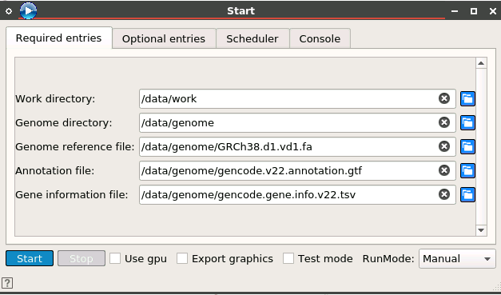
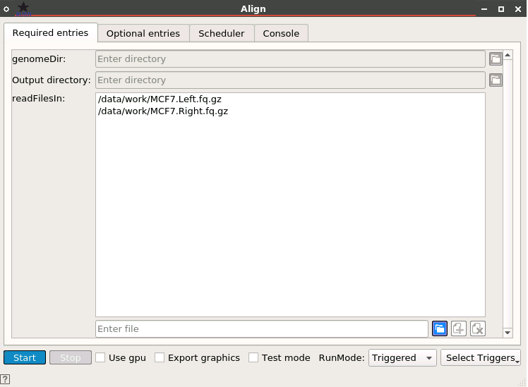
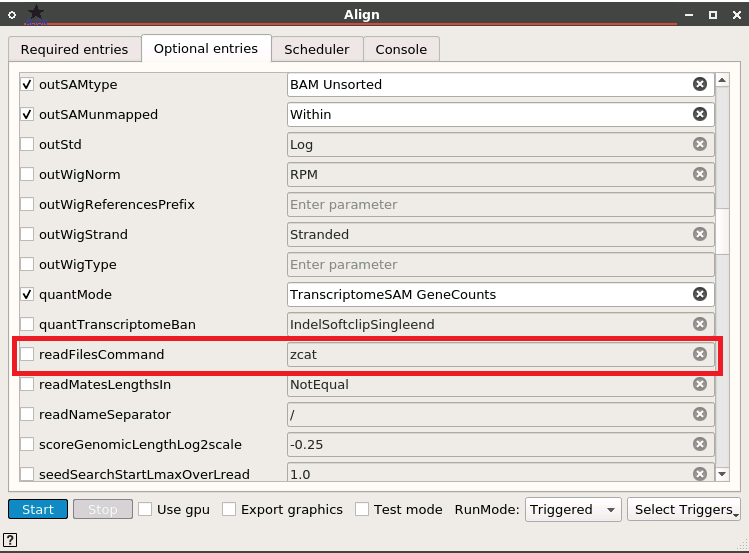
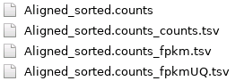
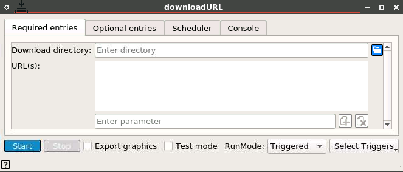
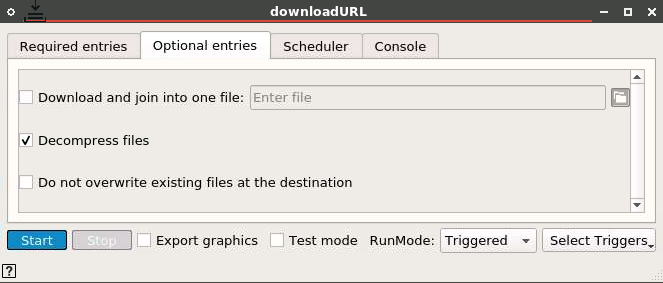

# GDC mRNA Analysis Pipeline

## Implemented with the BioDepot-workflow-builder (Bwb)

# Table of Contents
* [Overview](#overview)
  * [Reference genome](#reference-genome)
  * [Workflow in the demo state](#workflow-in-the-demo-state)
  * [Modifying workflow for alternate samples](#modifying-workflow-for-alternate-samples)
  * [Modifying workflow for alternate reference genome](#modifying-workflow-for-alternate-reference-genome)
* [Appendix](#appendix)
  * [Download widget](#download-widget)
    * [downloadURL](#downloadurl)
  * [Common issues with workflows](#common-issues-with-workflows)
  * [Software and hardware specifications](#software-and-hardware-specifications)
* [References](#references)

# Overview
The GDC mRNA analysis pipeline is based off of the Genomic Data Commons documentation located here: [https://docs.gdc.cancer.gov/Data/Bioinformatics_Pipelines/Expression_mRNA_Pipeline/](https://docs.gdc.cancer.gov/Data/Bioinformatics_Pipelines/Expression_mRNA_Pipeline/)

## Reference genome
All alignments are performed using the human reference genome GRCh38.d1.vd1. This can be found here: [https://gdc.cancer.gov/about-data/gdc-data-processing/gdc-reference-files](https://gdc.cancer.gov/about-data/gdc-data-processing/gdc-reference-files)

## Workflow in the demo state
Begin the workflow by clicking the Start button from the Start widget.

## Modifying workflow for alternate samples
The samples will be downloaded to the Bwb mapped /data/work directory. To change the default location of the sample files, the Start widgets required 'Work directory' entry should be updated to reflect this change.

The sample files are downloaded via the downloadURL widget (labeled 'Download sample files') in the demo state. Swap out the downloaded samples with your preferred samples and update the starAlign widget files.

Please note that the downloaded file names will be prepended with the work directory provided by the Start widget.

If the files you select are not compressed (gzipped), you have to uncheck the 'readFilesCommand' in the Optional entries tab. If your fastq files are gzipped, leave the entry checked.

After running the workflow, the files with gene expression counts are located in the /data/work directory.

## Modifying workflow for alternate reference genome
The default GRCh38 reference genome is downloaded via the widget named 'Download genome files'. If the reference file(s) are updated, populate the changes via the Start widget Reference genome file field.

# Appendix

## Download widget

### downloadURL
* Google Drive and any URL not requiring credentials is accessible via the _downloadURL _widget_._

## Common issues with workflows
One of the biggest issues with the GDC workflow is that several tools have changed throughout the course of their life cycles. Often major revisions of tools will come with option changes. Certain options may be deprecated or deleted entirely. Sometimes option flags will be renamed or inputs will need to be passed in a different way. All of these things sound very minor but turn what could be a straightforward workflow into a several hour debugging session. The point is to use care when updating tool versions or widgets.

## Software and hardware specifications
The GATK Germline workflow was tested on an AWS Elastic Cloud Compute (EC2)  instance with the following specifications:

| Option | Value |
|-|-|
| Instance Type | r5d.2xlarge
| Distribution | Ubuntu server 20.04
| Disk space | 50GB
| Memory | 64GB
| vCPU | 8

The workflow was tested with version 1.0 of Bwb ([https://github.com/BioDepot/BioDepot-workflow-builder/releases/tag/v1.0,0](https://github.com/BioDepot/BioDepot-workflow-builder/releases/tag/v1.0,0))

# References
_mRNA Analysis Pipeline_. GDC Docs. (n.d.). [https://docs.gdc.cancer.gov/Data/Bioinformatics_Pipelines/Expression_mRNA_Pipeline/](https://docs.gdc.cancer.gov/Data/Bioinformatics_Pipelines/Expression_mRNA_Pipeline/).