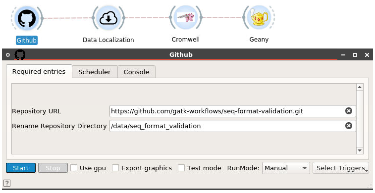
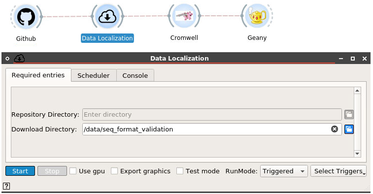
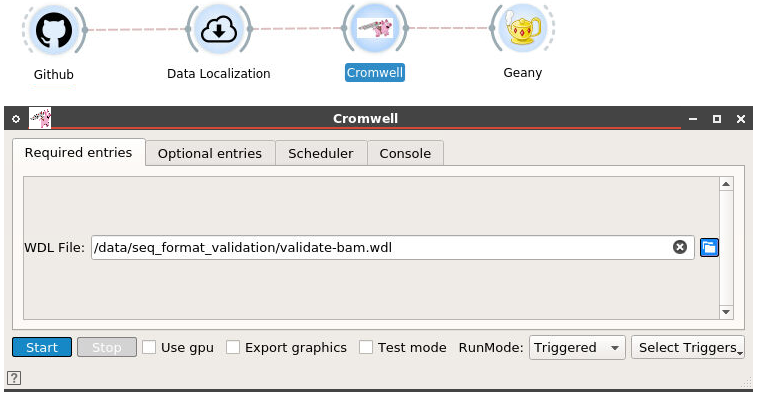
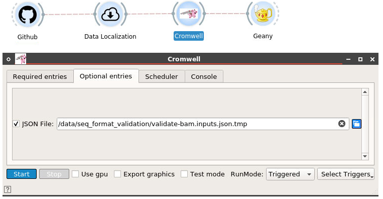
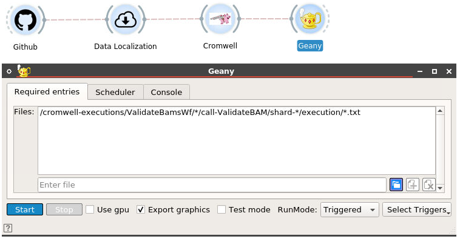

# Widgets

Github: to download the repository to local machine

Data Localization: to download all bioinformatics files specifying in the object files

Cromwell: to execute the WDL script (in the repository that downloaded from the github)

Geany: to view the results of sequence format validation

# How to use

1\. We double click on the **Github** widget to specify the repository to download to local machine. There are two fields that we need to fill up:
- **Repository URL**: the given Github repository URL
- **Repository Directory**: the specified directory to save on local machine

2\. We double click on the **Data Localization** widget to specify the directory that consists of object files. The idea is to grab all downloadable URL in the object files and later download them all to local machine. The new object files will be created with the extension **.tmp**. (We need to ensure selecting the right object files in the next widget) The new object files replace all URLs (Cloud) to local URL.
- **Repository Directory**: the specified directory to store files from repository (No need to specify because this value is the same as the one we indicated in the **Github** widget)
- **Download Directory**: the specified directory to save all bioinformatics files on local machine

3\. We double click on the **Cromwell** widget to specify the WDL script that we want to execute.

On the tab **Optional entries**, we select the new object file (with extension **.tmp**) to provide necessary key-value pairs for the WDL script.

4\. We double click on the **Geany** widget to open the output files. We can list all files to view for validation purpose (This configuration should remain **unchanged**)

# Tutorial Video:

